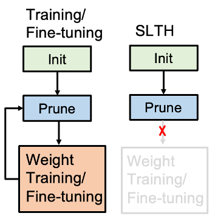
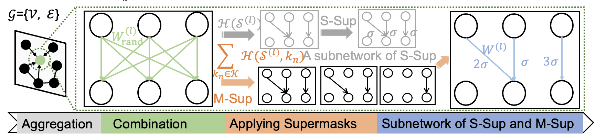
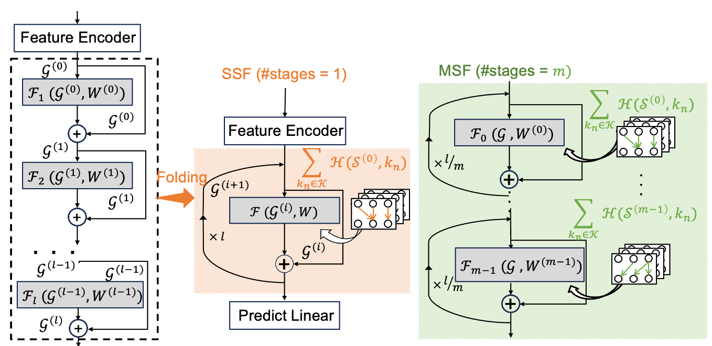

# SLT-GNN
This project is about Strong Lottery Tickets on Graph Neural Networks. It adopts multicoated supermasks and the folding method to achieve high sparsity, competitive performance, and high memory efficiency for GNNs without weight training. Additionally, all weights are initiated randomly without any training.

## Publication
The work [**"Multicoated and Folded Graph Neural Networks with Strong Lottery Tickets"**](https://openreview.net/forum?id=oLrNolMbO8) was accepted at Learning on Graphs Conference 2023. 

It utilizes multi-coated supermask to prune the original networks.

For deep GNNs, this work puts forward a folding method to optimize deep GNNs.

